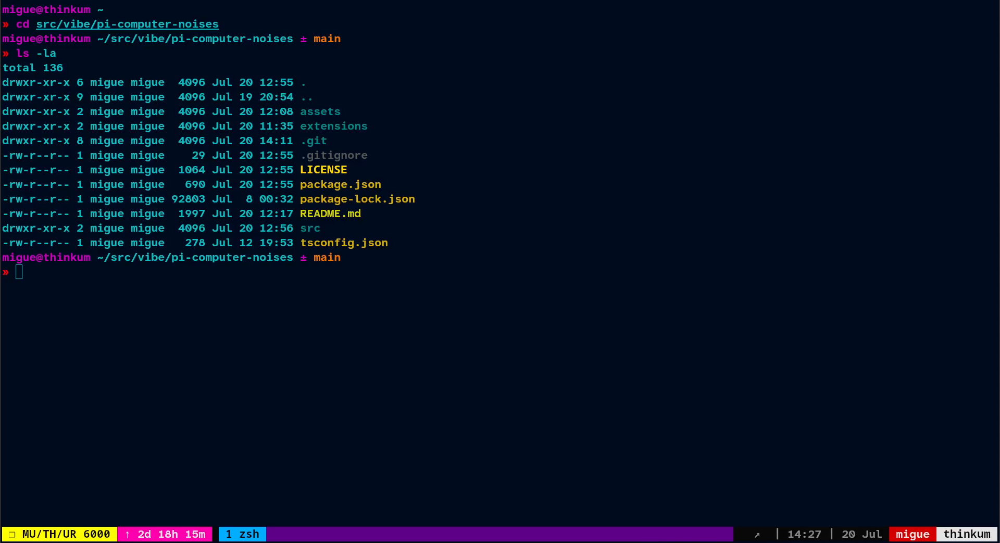

# pi-computer-noises

**Retro mainframe ambience** for pi: a 60Hz mainframe hum with data blips
while the agent thinks (70s/80s sci-fi console — WOPR, Star Trek). Fades to
silence when the last turn ends.

## How it sounds / works

- All sound is synthesized in pure TypeScript. Blips are a near-uniform
  telemetry stream of short electronic beeps at tightly-clustered pitches.
  Sparse ambient server-room beeps (spread across octaves) play over the hum
  even between turns.
- Everything is mixed into ONE continuous PCM stream fed to a single long-lived
  raw player (`pacat` / `pw-cat` / `ffplay` / `play`) on a dedicated worker
  thread, so timing stays sample-accurate and never stutters when the host's
  event loop is busy.
- **One shared instance per user**: any number of pi agents elect a single
  audio owner (Unix socket + `O_EXCL` lock file) and refcount active turns —
  hum + blips play while ANY agent is working and stop when the LAST one
  finishes.


<a href="https://github.com/enlavin/pi-computer-noises/raw/refs/heads/main/assets/muthur6000.mp4">
  
</a>

## Install on pi

```bash
pi install git:github.com/enlavin/pi-computer-noises
# or local checkout:
pi install /path/to/pi-computer-noises
```

Enable/disable with `pi config`. Remove with `pi remove /path/to/pi-computer-noises`.

## Requirements

- A raw-PCM player: `pipewire` (`pw-cat`), `pulseaudio-utils` (`pacat`),
  `ffmpeg` (`ffplay`), or `sox` (`play`).
- On Debian/Ubuntu WSL: `sudo apt install pulseaudio-utils`.
- **OS support**: WSL and native Linux. macOS/Windows-native only if `ffmpeg`
  or `sox` is installed. No raw player found → silently no-ops.

## Tuning

Edit `src/mainframe.ts`: `SCALE` (blip pitches), `GAP_BASE`/`GAP_JITTER` (blip
spacing), `HUM_LEVEL` (hum loudness), `WINDOW_MS` (how long blips linger after
the last update).

[Sample audio clip](https://github.com/enlavin/pi-computer-noises/raw/refs/heads/main/assets/audition.mp3)

Audition standalone: `bun src/mainframe.ts --audition 8`
